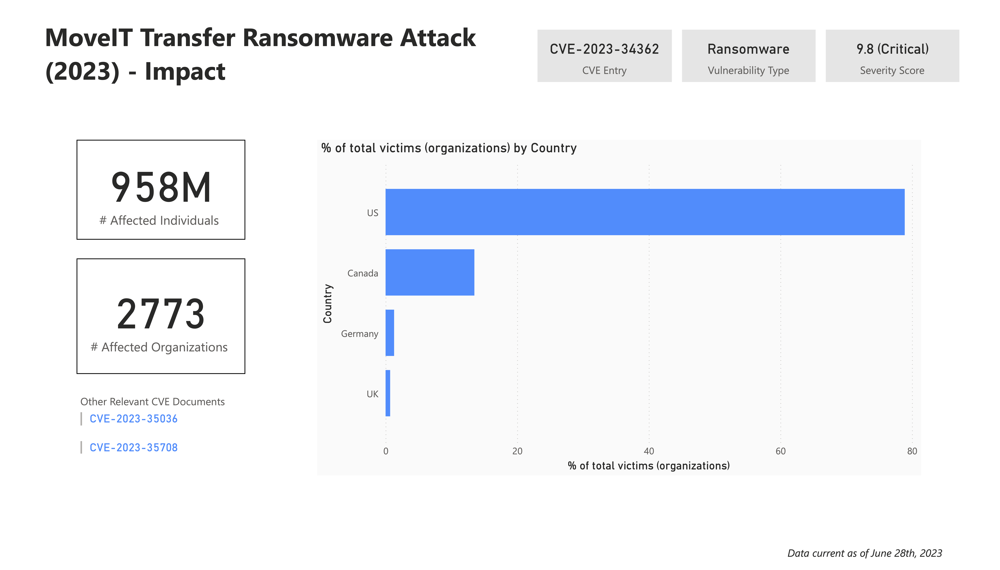

Table of Contents:
- Overview
- Detailed Analysis of the Attack
- Impact(PowerBI Dashboard) 
- Company Response
- Sources

## Overview 
In May 2023, MoveIT file transfer software was compromised by a zero-day SQL injection vulnerability (*CVE-2023-34362*). Ransomware group known as Cl0P had gained access to MoveIT's internal servers, and installed a webshell to gain persistent remote access to secure data. 

Rather than encrpyting data and demanding payment, the group simply exfiltrated data and demanded money to prevent public release.

> **MoveIT Transfer**: 
MoveIT is a secure file-transfer software owned by the company Progress. It's widely used by institutions in highly regulated industries that require a secure transfer of data (in keeping with compliance standards). [3]

>**SQL Injection:** SQL injection is a method of gaining unauthorized access/ privileges to a database by leveraging insecure input fields from the client to the application. 
>More information: https://owasp.org/www-community/attacks/SQL_Injection

## Detailed Analysis of the Attack 

Leveraging an SQL injection vulnerability, The attackers had successfully installed a webshell into compromised MoveIT servers allowing them to perform various commands. Compromised systems contained the file "human2.aspx" in the "\wwwroot" directory of the software, likely named this way to mimic the structure of two native files to the transfer software: machine2.aspx and human.aspx. [3]

1. Authentication 
- The webshell checks the headers of the http request for a field called "X-siLock-Comment", and will reject any requests that do not include a certain string code. 
- Upon successful authentication, the malicious code attempts to make a database connection.

2. WebShell Functions
- The code also checks for a field called "X-siLock-Step1" and will perform different actions depending on that value. 
- A value of -1, will trigger a set of database queries which receives information such as file and folder names, folder paths, names of institutions. It will also append AzureBlob information (StorageAccount, BlobKey, BlobContainer) into the header of the response.
    - The headers "X-siLock-Step2" and "X-siLock-Step3" contain additional information that determine the behaviour of the webshell. If they resolve to null, then a new user with administrative privilages called "Health Check Service" will be created (along with new session data), and added to the database. 
    - If those are not null, then they contain information that is used to resolve a specific file path. This is used to exfiltrate data from that path, which is then zipped as a GZipStream, and sent back in the response. 
- A value of -2, will trigger an SQL delete operation to remove the "Health Check Service" user from the database.

In Summary:
The webshell is capable of...
- Retrieving Microsoft Azure Settings
- Exfiltrating data from the SQL database
- Retrieving information from a specified file path
- Creating a new user with administrative privilages (Health Check Service)
- Deleting that user with administrative privilages 

## Impact (PowerBI Dashboard)

## Progress Company Response

The vulnerabilty was first discovered on May 27th, 2023.
- [May 31st] - Progress released an article acknowledging the vulnerability, alongside software patches for various affection versions, and recommended remediation steps for customers.  
- [June 9th] - A second patch is administered for SQLi injection vulnerabilities (CVE-2023-35036) within the transfer software. Progress announces partnership with third-party cyber security investigators that had discovered the new vulnerabilities.  
- [June 15th] - Yet another vulnerability is disclosed by progress (CVE-2023-35708) alongside the required patches, and potential remediation steps.

### Relation to NIST CSF
NIST CSF outline a set of best practices for organizations to manage and organize their cybersecurity risk. There are 5 core functions specified by the framework. These include Govern (GV), Identify (ID), Protect (PR), Detect (DE), Respond (RS) and Recover (RC).
This report will analyze, the company's response based on it's implementation of the last three functions (most pertinent to the ransomware attack)

#### 1. Detect (DE)

*"Possible cybersecurity attacks and compromises are found and analyzed."*

Although exploitation of the vulnerability was first discovered on May 27th. Evidence of possible threat actors exploiting the vulnerability as a means of testing were discovered as early as 2021 [6]. This indicates Progress' failure to monitor and detect potential a critical vulnerabilty within their own software in a timely fashion.  

#### 2. Respond (RS)

*"Actions regarding a detected cybersecurity indcident are taken*"

Following May 27th, Progress responded quickly to investigate the situation and respond to the discovered vulnerabilities. Some key points are noted below:
1. Patches were communicated to the public in a timely fashion, alongside remediation/mitigation steps for customers. Information was clearly documented on their website. Email communications would bolster their response strategy (it may have been employed however).
2. Partnership with third-party cybersecurity investigators helped Progress discover other vulnerabilities that were also addressed quickly.
3. Release of "Service Pack Program" to improve product and security fixes indicates commitment to much quicker incident response in the future, and focus on customer feedback. 
4. Following the discovery of CVE-2023-34362 and CVE-2023-35708, Progress software took down http and https traffic for their cloud-based environment out of caution, before promptly applying fixes and restoring services. 

#### 3. Recover (RC)

*"Assets and operations affected by a cybersecurity incident are restored"*

Due to the nature of the cyber attack, lost assets (customer information), cannot feasibly be recovered. Many organizations and individuals have had data leaked to malicious third-parties, who may utilize the information for wrongful purposes. Progress' quickly brought operations back to normal function, but no clear plan/ communication has been given as to restoration of assets.

## Sources
[1] https://owasp.org/www-community/attacks/SQL_Injection

[2] https://www.cisa.gov/news-events/cybersecurity-advisories/aa23-158a

[3] https://www.deepwatch.com/labs/operation-i-like-to-moveit-moveit-active-exploitation-of-moveit-transfer-leads-to-data-theft/

[4] https://www.emsisoft.com/en/blog/44123/unpacking-the-moveit-breach-statistics-and-analysis/

[5] https://community.progress.com/s/article/MOVEit-Transfer-Critical-Vulnerability-31May2023

[6] https://www.kroll.com/en/publications/cyber/clop-ransomware-moveit-transfer-vulnerability-cve-2023-34362
